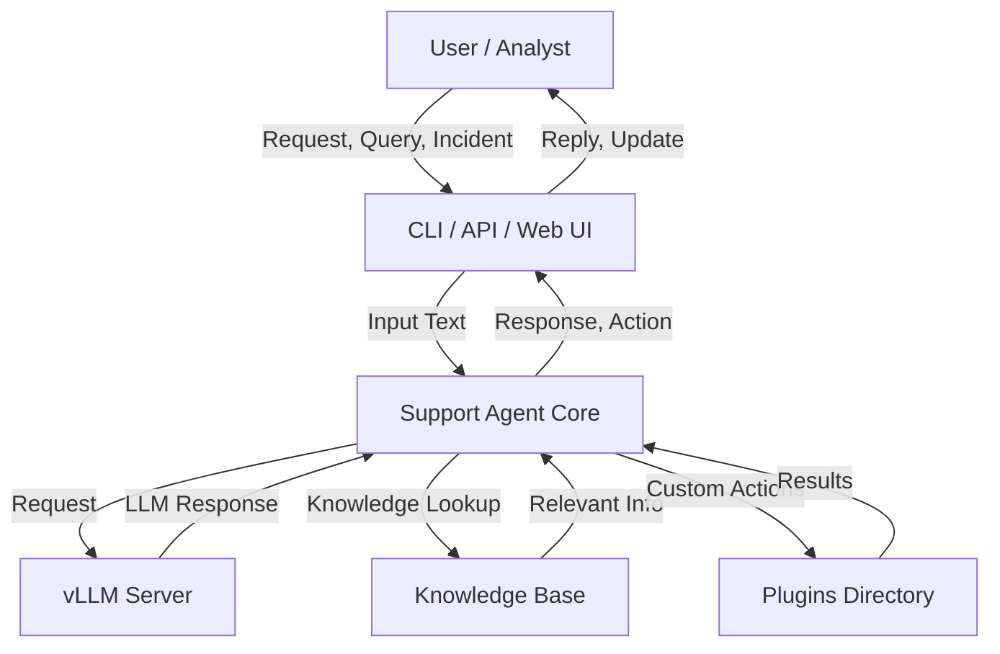

# COS30018-vLLM-Cybersecurity-Support-Agent

A powerful, modular, and extensible support agent framework for cybersecurity, leveraging vLLM for natural language understanding and automated response. This project aims to assist cybersecurity professionals and users by providing intelligent, context-aware support for security incidents, best practices, and system queries.

---

## Introduction

COS30018-vLLM-Cybersecurity-Support-Agent is designed to act as an intelligent assistant for cybersecurity operations. It utilizes large language models (LLMs) via vLLM to interpret requests, analyze incidents, and provide actionable guidance. This project is suitable for academic environments, research, or integration into enterprise security suites.

---

## Features

- **vLLM Integration**: Uses vLLM for efficient, scalable, and high-throughput language model inference.
- **Incident Analysis**: Automatically analyzes and summarizes security incidents.
- **Knowledge Base Support**: Answers common cybersecurity questions based on structured internal knowledge.
- **Extensible Plugins**: Add custom response modules for organization-specific workflows or tools.
- **Contextual Response**: Maintains context across conversations for accurate and tailored advice.
- **API Endpoints**: Interact with the agent programmatically for automation or integration.
- **Role Management**: Supports different user roles and permissions for secure usage.
- **Logging and Auditing**: Tracks requests, responses, and actions for compliance and troubleshooting.

---

## Usage

Follow these steps to set up and use the COS30018-vLLM-Cybersecurity-Support-Agent:

1. **Clone the Repository**
   ```bash
   git clone https://github.com/Schnitze1/COS30018-vLLM-Cybersecurity-Support-Agent-.git
   cd COS30018-vLLM-Cybersecurity-Support-Agent-
   ```

2. **Install Dependencies**
   Ensure you have Python 3.8+ and `pip` installed. Then:
   ```bash
   pip install -r requirements.txt
   ```

3. **Configure the Application**
   Update the `config.yaml` (or equivalent config file) to set your environment variables, API keys, and vLLM model paths.

4. **Run vLLM Server**
   Start your vLLM backend for language model inference, according to vLLM documentation.

5. **Start the Support Agent**
   ```bash
   python main.py
   ```

6. **Interact with the Agent**
   - Use the provided CLI, API, or Web UI (if included) to submit queries or incidents.
   - Integrate with your SIEM, ticketing system, or chat platform as needed.

---

## Configuration

The support agent is configured using a YAML or JSON file, typically named `config.yaml` or `config.json`. Key configuration options include:

- **vLLM Model Path**: Path or identifier for the language model checkpoint.
- **Plugin Directory**: Directory for custom response or action plugins.
- **API Settings**: Host, port, and authentication for the REST API.
- **Logging**: Level, format, and output location for logs.
- **Security**: User roles, permissions, and access control options.
- **Knowledge Base Sources**: Specify locations for structured cybersecurity knowledge.

Example configuration snippet:

```yaml
vllm:
  model_path: "path/to/vllm/model"
api:
  host: "0.0.0.0"
  port: 8080
  auth_token: "your-secret-token"
logging:
  level: "INFO"
  file: "logs/agent.log"
security:
  roles:
    - admin
    - analyst
    - user
knowledge_base:
  files:
    - "knowledge/cybersecurity_faq.yaml"
    - "knowledge/best_practices.yaml"
```

---

## Requirements

- **Python 3.8+**
- **vLLM** (installed and running, with access to the chosen LLM checkpoint)
- **PyYAML** (for configuration)
- **Flask** or similar (for API, if applicable)
- **Other dependencies** as listed in `requirements.txt`
- **Sufficient RAM/VRAM** for running large language models
- **Network access** for API integrations (optional)

---

## License

This project is licensed under the GNU General Public License v3.0 (GPL-3.0).

You are free to use, modify, and distribute this software under the terms of the GPL-3.0. See the [LICENSE](LICENSE) file for full license text.

---

## Architecture Overview

Below is a flowchart illustrating the main components and data flow within the agent:



---

## Contributing

Contributions are welcome! Please open issues or submit pull requests to help improve the project.

---

## Support

For questions, issues, or feature requests, open a GitHub issue or contact the repository maintainer.

---

## Acknowledgments

- vLLM project
- Open-source cybersecurity knowledge bases
- Swinburne University of Technology (for COS30018 inspiration)
